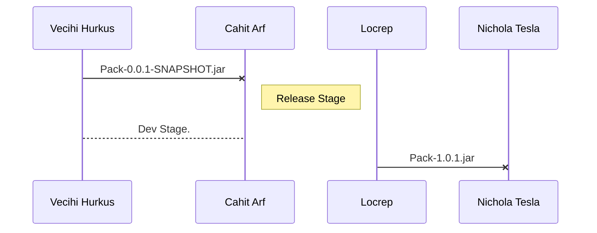
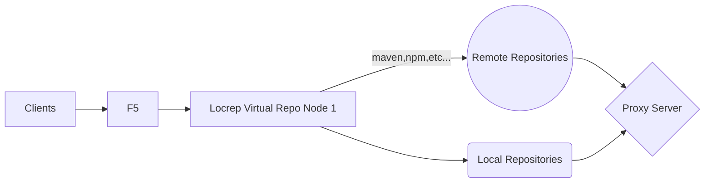

# LocRep OpenSource Artifact Management Project for DevOps

**LocRep official website** (http://locrep.com/) 

**LocRep test website** (http://dev.locrep.com/)

**LocRep test Agile and DevOps WebSite** (https://dev.azure.com/LocRep/)


## SmartyPaenter code herents

SmartyPants converts ASCII punctuation characters into "smart" typographic punctuation HTML entities. For example:

|                |Scope                         |Status|
|----------------|------------------------------|-----------------------------|
|*			|`maven`            |      Coding	|
|*          |`nuget`            |           	|
|*          |`npm`				|				|


## UML diagrams




And this will produce a flow chart:




```

